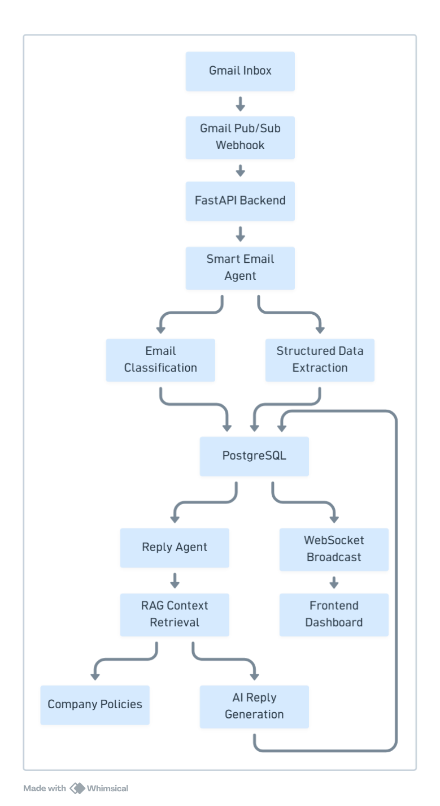

# 🚀 AI Email Automation System

An AI-powered email automation platform that integrates with Gmail to automatically classify, process, and generate intelligent replies using AI workflows and RAG-based contextual retrieval.

---

## Features

- Google OAuth Integration (Connect Gmail)
- Real-time Email Processing using Gmail Webhooks
- AI-powered Email Classification & Reply Generation
- Structured Information Extraction from Emails
- Context-aware Replies using RAG
- Real-time Frontend Updates via WebSockets
- Secure Authentication using JWT and Cookies
- Duplicate Webhook Protection
- Lightweight AI Workflow optimized for low latency

---

## System Architecture



---

## AI Workflow Architecture

The system uses a lightweight AI workflow orchestrated using LangGraph.

### Workflow Pipeline

```text
Incoming Email
      ↓
Smart Email Agent
      ├── Email Classification
      ├── Structured Data Extraction
      └── Database Processing
      ↓
Reply Agent
      ├── Context Retrieval (RAG)
      └── AI Reply Generation
      ↓
Realtime WebSocket Broadcast
```

---

## AI Agents

The architecture was optimized from a **5-agent workflow** to a **lightweight 2-agent workflow** to significantly reduce latency and improve throughput.

### Smart Email Agent
- Classifies incoming emails
- Extracts structured information
- Stores category-specific data
- Handles:
  - Refund Requests
  - Return Requests
  - Complaints
  - Product Questions
  - Exchange Requests
  - Order Status Queries

### Reply Agent
- Retrieves contextual company policies
- Generates AI-powered professional replies
- Produces concise and context-aware responses
- Saves generated replies to database

---

## Email Categories

- Order Status
- Return Request
- Exchange Request
- Refund Request
- Product Question
- Complaint
- General
- Others

---

---

## Example: Smart Email Agent Workflow

### Incoming Email

```text
Subject: Refund not received for Order ORD1023

Body:
Hi Team,

I requested a refund for my laptop purchase last week,
but I still haven't received the amount in my bank account.

Please help.

Thanks,
Rahul
```

### Smart Email Agent Output

The Smart Email Agent performs:
- Email Classification
- Structured Data Extraction
- Ticket/Data Creation

### Extracted Structured Data

```json
{
  "category": "refund_request",
  "order_id": "ORD1023",
  "reason": "Refund not received",
  "customer_email": "rahul@gmail.com"
}
```

### Database Ticket Creation

The extracted information is automatically stored as a structured refund request ticket:

```text
RefundRequest
├── order_id: ORD1023
├── customer_email: rahul@gmail.com
├── reason: Refund not received
└── org_id: 1
```

### Next Workflow Step

The Reply Agent then:
- Retrieves refund policy context
- Generates a professional AI response
- Stores the generated reply in database

## How It Works

1. User connects Gmail using Google OAuth
2. Gmail sends webhook events for new emails
3. Backend fetches new email data
4. LangGraph workflow executes:
   - Email classification
   - Structured data extraction
   - Context retrieval using RAG
   - AI reply generation
5. Replies are stored and broadcasted in real-time
6. Users can review or send replies manually

---

## Performance

### Workflow Performance

| Component | Avg Latency |
|---|---|
| Smart Email Agent | ~1.2s |
| Reply Agent | ~1.6s |
| Complete Workflow | ~3.0s |

### Classification Accuracy
- Achieved approximately **95% classification accuracy** across:
  - Returns
  - Refunds
  - Complaints
  - Product Questions
  - Order Queries
  - Exchange Requests

### Optimization Highlights
- Reduced workflow from **5 AI agents → 2 AI agents**
- Optimized average workflow latency to ~3 seconds
- Minimized redundant DB queries and commits
- Implemented duplicate webhook protection
- Reused global LLM instances for lower overhead

---

## Tech Stack

### Backend
- FastAPI
- SQLAlchemy
- PostgreSQL (Neon)

### AI / ML
- LangGraph
- Groq LLM (LLaMA 3.1)
- Sentence Transformers

### Database
- Neon PostgreSQL

### Authentication & Security
- JWT Authentication
- Secure Cookie-based Sessions
- Google OAuth 2.0

### Realtime
- WebSockets

### DevOps
- Docker
- CI/CD Pipeline
- Environment-based Configuration

### Integrations
- Gmail API
- Gmail Pub/Sub Webhooks
- Google OAuth APIs

---

## Real-time Processing Architecture

- Gmail Pub/Sub triggers webhook events
- Backend processes emails asynchronously
- Duplicate webhook protection ensures idempotent processing
- WebSockets broadcast updates instantly to frontend

---

## RAG-based Context Retrieval

- Company policies embedded using Sentence Transformers
- Context retrieved dynamically during reply generation
- Enables policy-aware and context-aware AI responses

---

## Project Structure

```text
app/
│── agents/          # AI workflow agents
│── database/        # Database models & setup
│── routes/          # API routes
│── workflows/       # LangGraph workflows
│── services/        # Gmail, RAG, WebSocket services
│── schemas/         # Pydantic schemas
│── core/            # Shared LLM & configs
```

---

## Setup Instructions

### 1. Clone Repository

```bash
git clone https://github.com/your-username/email-automation.git
cd email-automation
```

### 2. Create Virtual Environment

```bash
python -m venv venv

# Windows
venv\Scripts\activate

# Mac/Linux
source venv/bin/activate
```

### 3. Install Dependencies

```bash
pip install -r requirements.txt
```

### 4. Configure Environment Variables

Create a `.env` file:

```env
JWT_SECRET=your_secret
JWT_ALGORITHM=HS256

GOOGLE_CLIENT_ID=your_client_id
GOOGLE_CLIENT_SECRET=your_client_secret
GOOGLE_REDIRECT_URI=http://localhost:8000/auth/google/callback

DATABASE_URL=your_neon_database_url
```

---

## Authentication Flow

- User authenticates using Google OAuth
- JWT token is generated
- Token stored securely in cookies
- Backend validates JWT on every request

---

## API Endpoints

### Authentication

- `GET /auth/google`
- `GET /auth/google/callback`

### Emails

- `POST /emails/gmail/webhook`
- `GET /emails/category/{category}`
- `GET /emails/mail/{emailid}`
- `PUT /emails/{email_id}`
- `POST /emails/send/{email_id}`

### WebSocket

- `WS /emails/ws`

---

## Key Highlights

- AI-powered email automation platform
- Lightweight LangGraph-based workflow system
- Optimized 2-agent AI architecture
- RAG-based context-aware reply generation
- Real-time email processing via Gmail Webhooks
- Average end-to-end workflow latency of ~3 seconds
- ~95% email classification accuracy
- Duplicate webhook protection & idempotent processing
- Realtime frontend synchronization via WebSockets
- Production-ready backend architecture with Docker & CI/CD
